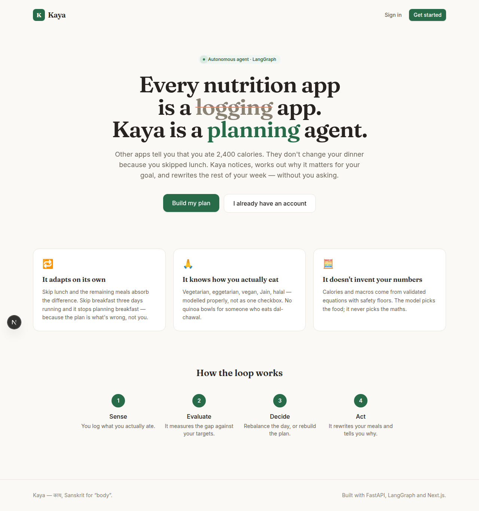
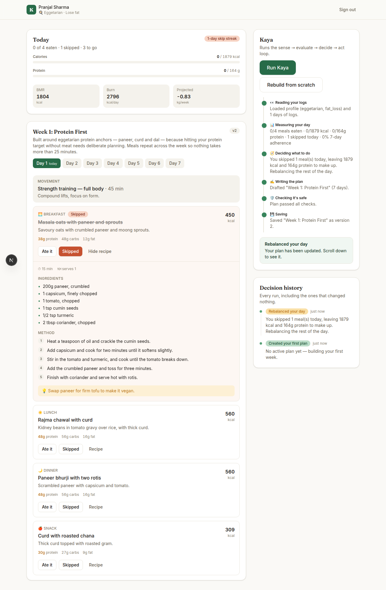
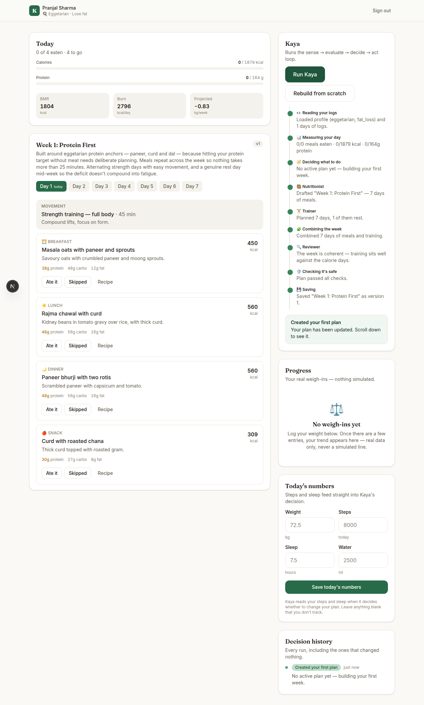
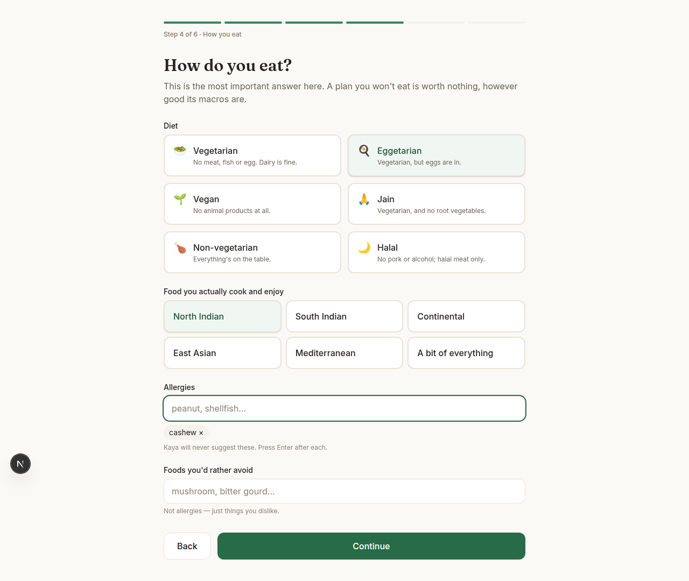
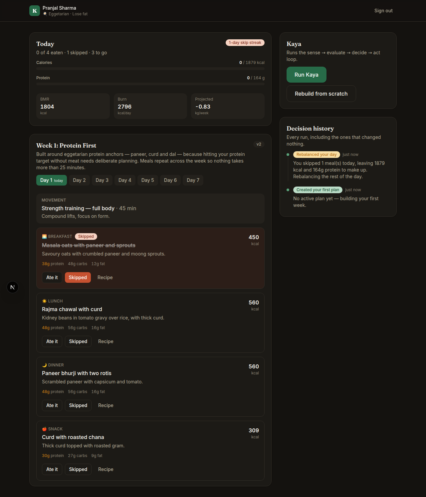
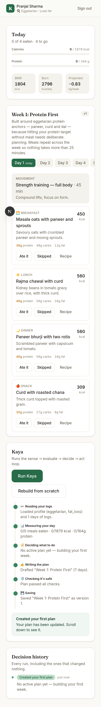

# Kaya — an autonomous nutrition coach that replans when life happens

> *Kaya* (काया) — "body," in Sanskrit and Hindi.

**Every nutrition app is a logging app. Kaya is a planning agent.**

MyFitnessPal will tell you that you ate 2,400 calories. It will not change your dinner
because you skipped lunch. The plan stays frozen; the human is expected to adapt.

Kaya inverts that. When you skip a meal, blow past your target, or fall off three days
running, a LangGraph agent notices, decides what kind of change is warranted, and rewrites
your week — without being asked.

📄 **[Full problem statement](docs/PROBLEM_STATEMENT.md)** ·
🛠 **[Architecture & setup](#running-it-locally)** ·
🚀 **[Deployment](docs/DEPLOYMENT.md)** ·
🚚 **[Migrating from the Streamlit version](docs/MIGRATION.md)**



---

## The loop

```
   SENSE            EVALUATE           DECIDE            ACT
   ─────            ────────           ──────            ───
   meal logs   →   adherence      →   should we    →   regenerate
   skips           vs. targets        replan? what      affected days
   weight          trend + streaks    kind?             + explain why
      ▲                                                      │
      └────────────────── persist ◄──────────────────────────┘
```

Concretely — you mark lunch as skipped:

1. **Sense** — the skip lands in the log store.
2. **Evaluate** — plain Python computes the remaining calorie and protein budget, the skip
   streak, and the 7-day adherence rate.
3. **Decide** — one skip rebalances today's remaining meals. Three days of skipped
   breakfasts restructures the plan, because at that point the plan is what's wrong.
4. **Act** — the LLM regenerates within your diet type, allergies, budget and prep time,
   and writes a plain-language rationale.
5. **Persist** — saved as a new version, so the whole decision history stays browsable.



---

## What makes it more than a prompt wrapper

### Three specialists, not one generalist

```
sense ─► evaluate ─► decide ─┬─(no action)──────────────────────► record ─► END
                             │
                             └─(plan needed)─► start_generation
                                                 │         │
                                      ┌──────────┘         └──────────┐
                                      ▼                              ▼
                                 nutritionist                     trainer
                                      └──────────┐         ┌──────────┘
                                                 ▼         ▼
                                                 assemble
                                                    │
                                                    ▼
                                                 critique
                                      ┌─────────────┤
                              (revise)│             │(ok)
                                      │             ▼
                                      │          validate
                                      │             │
                                      ├─────────────┤(retry)
                                      │             ├─(valid)────► persist ─► END
                                      │             └─(exhausted)► record ──► END
                                      └──► nutritionist
```

A **nutritionist** plans food and a **trainer** plans movement, concurrently, each seeing
only the constraints its own half needs — the trainer never receives diet rules or macro
targets, and is told never to prescribe food. Splitting them keeps each prompt short and
each structured output small, and small structured outputs are the reliable ones. Because
they fan out in the same LangGraph superstep, the week is drafted in roughly the time one
call takes rather than two.

A **critic** then reads the assembled week for problems only visible once the halves are
combined — the heaviest session landing on the lightest calorie day, no genuine rest day,
elaborate cooking stacked on the busiest days. It gets exactly one revision round; a
reviewer allowed to keep asking would spend the user's time on diminishing preferences.

Two edges run *backwards*, which is what makes this an agent rather than a pipeline: from
`critique` when the reviewer objects, and from `validate` when a plan is rejected. Each
carries specific feedback, so the next attempt is a correction rather than a reroll. A
retry redraws only the meals — the validator inspects food, so food is what a rejection is
about, and regenerating a training week that was fine costs a call for nothing.



**The ordering of the last two stages is the safety property.** The critic is a language
model and only advises; `validate` is deterministic and has the final say. A model that
approves an unsafe plan must not be able to make it safe — and there's a test that holds
that line.

### Deterministic guardrails wrap LLM judgment

Nutrition is a domain where a hallucination is a health risk, so the work is split:

| Owned by Python | Owned by the LLM |
|---|---|
| BMR/TDEE (Mifflin-St Jeor) | Which foods |
| Calorie floors, deficit clamps | How to sequence a week |
| Protein and fat minimums | Recipes and phrasing |
| The decision to replan | How to explain a change |

**The LLM picks the food. It never picks the numbers.**

A validation layer then rejects any plan that violates the user's diet type, contains a
declared allergen, misses the protein floor, drifts outside calorie tolerance, or claims
macros that don't reconcile with its own calorie count. Rejected plans are regenerated
with targeted feedback, up to three attempts.

The last check is grounded rather than arithmetic. A curated
[ingredient table](backend/app/services/ingredients.py) derives, per diet, the highest
protein density any real food can reach — 0.15 g/kcal for vegan, 0.24 for non-vegetarian.
A meal claiming 50g of protein in 200 kcal with no carbs or fat *reconciles perfectly*
under the 4/4/9 rule and is still impossible; only the ceiling catches it. The same table
grounds the planner's prompt, so the model builds meals from foods that exist with numbers
that are approximately right, instead of asserting a figure it likes.

Recipes go one better: every ingredient carries a weight in grams, so a meal's macros are
**computed** rather than bounded. The sum is checked against what the plan claimed, the
model gets one correction round if the portions don't reach it, and the result is shown to
the user either way — a number you can check beats a number you have to trust. Where too
few ingredients are recognised to judge fairly, it says so instead of blaming the recipe
for gaps in the table.

Why a curated table and not USDA FoodData Central: USDA has effectively no coverage of the
food Kaya plans — no rajma chawal, no poha, no chapati as anyone in India makes one. A
nutrition database that doesn't know the cuisine is worse than none, because it returns
confident wrong numbers.

### Diet types modelled properly

"Vegetarian" is not one thing. Kaya models **vegetarian, eggetarian, vegan, Jain,
non-vegetarian and halal** as first-class constraints — Jain excludes root vegetables,
vegan protein needs deliberate planning, eggetarian leans on eggs at breakfast. A plan you
won't eat has an adherence rate of zero, however good its macros are.



### It explains itself

Every plan carries an `agent_reasoning`. Every run — *including the ones that change
nothing* — is written to a decision timeline. "The agent checked and you're fine" and "the
agent never ran" are different states, and the UI shows which one you're in.

---

## Stack

| Layer | Choice | Why |
|---|---|---|
| Frontend | Next.js 16, TypeScript, Tailwind v4 | Real routing, SSE streaming, deploys to Vercel without a cold boot |
| Backend | FastAPI, async | Native Pydantic — the same models the agent speaks — plus generated OpenAPI docs |
| Agent | LangGraph | Concurrent specialists, cyclic revision — the graph *is* the documentation of the behaviour |
| LLM | Groq / Llama 3.3 70B | Fast and free, behind a provider interface — swapping to GPT-4o is a config change |
| Database | MongoDB (Motor) | Plans are deeply nested, schema-evolving documents |
| Auth | JWT + bcrypt | Stateless, multi-tenant, no cookie/CSRF machinery |

---

## Running it locally

**Prerequisites:** Python 3.11+, Node 18+, a MongoDB connection string, and a
[free Groq API key](https://console.groq.com).

### Backend

```bash
cd backend
python -m venv venv
source venv/bin/activate        # Windows: venv\Scripts\activate
pip install -r requirements.txt

cp .env.example .env             # fill in MONGODB_URI, GROQ_API_KEY, JWT_SECRET
uvicorn app.main:app --reload --port 8000
```

Interactive API docs at <http://localhost:8000/docs>.

### Frontend

In a second terminal:

```bash
cd frontend
npm install
cp .env.example .env.local
npm run dev
```

Open <http://localhost:3000>.

### Tests and evals

```bash
cd backend
pip install -r requirements-dev.txt
python -m pytest -q          # 445 tests
python -m evals.run          # agent evaluation report
```

No database server, LLM or network required — the API tests run against an in-memory
Mongo with a stubbed model, and the agent's decision rules are plain Python.

The suite has three layers:

- **Example tests** — nutrition maths, decision rules, validation, and the full HTTP
  path including auth and tenant isolation.
- **Property tests** — invariants across the *entire* valid input space rather than
  chosen examples: no profile anywhere produces a target below the calorie floor, fat
  never drops under the essential minimum, macros always reconcile. Hypothesis found the
  edge case where the floor pushes a very small, very sedentary user *above*
  maintenance — and the user-facing copy that got that case wrong.
- **[Agent evals](backend/evals/README.md)** — 13 decision scenarios with a confusion
  matrix, and 19 validator cases split into false positives (burns a retry) and false
  negatives (lets a bad plan through). Two known misses are recorded in the suite and
  excluded from the score, because a detector evaluated only on cases it was built to
  catch always reports 100%.

---

## Repository layout

```
backend/
  app/
    agent/        LangGraph workflow, specialist prompts, validation, LLM provider
    api/routes/   auth · profile · plans · logs · agent
    core/         config, security, logging
    db/           Mongo lifecycle + repositories
    models/       Pydantic domain models and enums
    services/     nutrition math, adherence evaluation, ingredient table
  evals/          agent evaluation suite (decisions + validator detection)
  tests/          445 tests — examples, properties, API integration, evals
frontend/
  app/            landing · login · register · onboarding · dashboard
  components/     agent runner, meal cards, UI primitives
  lib/            typed API client, auth context, labels
docs/             problem statement, migration guide
legacy/streamlit/ the original prototype, still runnable
```

---

## On performance

The Streamlit version cold-started for 30–60 seconds and sometimes timed out entirely.
Three things changed:

1. **The database connects at startup**, not lazily inside the first request. The TLS
   handshake and auth round-trip happen while the container boots, and `minPoolSize` keeps
   connections warm rather than reopening them per request.
2. **The agent streams.** You watch it sense, evaluate, decide, draft and validate rather
   than staring at a spinner.
3. **Recipes are lazy.** A week of full recipes is ~8k output tokens most people never
   read; they're generated per meal, on demand, and cached.

There's also a `/health` endpoint suitable for an uptime pinger, which stops a free-tier
host from spinning the container down between visitors — `.github/workflows/keepalive.yml`
does exactly that. See **[docs/DEPLOYMENT.md](docs/DEPLOYMENT.md)** for the full
Render + Vercel + Atlas setup.

---

## Roadmap

- [x] Multi-user auth and preference-aware planning
- [x] Deterministic safety layer with validation retry
- [x] Streamed agent runs and decision history
- [x] Adaptive rebalancing on skipped meals
- [x] Weight, steps, sleep and water logging with a real trend chart
- [x] CI on push; Docker, Render blueprint and deployment guide
- [x] Property-based safety proofs and an agent evaluation suite
- [x] Curated ingredient table grounding the protein ceiling and the planner prompt
- [x] Per-ingredient gram quantities, so recipe macros are computed and verified
- [ ] Google Fit / Fitbit OAuth for passive sensing
- [ ] Weekly email digests
- [x] Multi-agent split: nutritionist + trainer + critic, fanned out concurrently

---

## Screenshots

| Dark mode | Mobile |
|---|---|
|  |  |

---

## About

Built by **Pranjal Sharma** ([@pranjalsharma-6](https://github.com/pranjalsharma-6)).

This started as a Streamlit prototype demonstrating LangGraph. It was rebuilt as a
full-stack system to address the parts that a prototype can't: multi-tenancy, safety,
observability, and a plan that actually adapts to the person following it.

MIT licensed.
